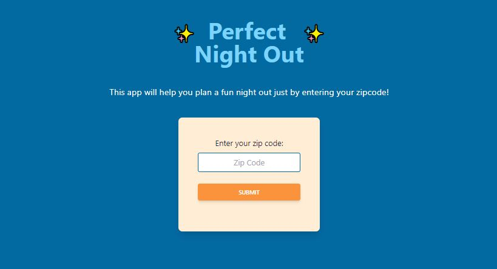

# Perfect Night Out

## Table-of-Contents

- [Description](#description)
- [Deployed Site](#deployed-site)
- [Features](#features)
- [Technologies](#technologies)
- [Future Development](#future-development)
- [Credits](#credits)

## Description

Have you ever wanted to plan a night out with your friends, but found yourself spending a ton of time looking up different places you could go? Well with this app, you can enter your zip code and find results for local breweries and movie theaters near you! When looking at your results in the Brewery section, Breweries are listed by location name, with their address and websites listed as well.

## Deployed Site

Follow [this link](https://ashlynn4567.github.io/Perfect-Night-Out/) to view and use our site!

## Features

This is how the main page appears to users. The page is responsive, adapting to multiple screen sizes.

The user enters their zip code in the search bar at the top of the screen. Once the user has input a zipcode, the brewery section will refresh with data showing local breweries near the given zip code. Both the theater and brewery section have their own scrolling functionality.

The user is able to click on the website link in the Brewery data to be redirected to that brewery's website. They can also click on the title of the Movie to find a summary website page, along with a trailer for that particular movie.

## Technologies

- HTML
- CSS
- JavaScript
- [jQuery](https://jquery.com/)
- [Tailwind CSS](https://tailwindcss.com/)
- [Open Brewery DB](https://www.openbrewerydb.org/)
- [Gracenote API](https://developer.tmsapi.com/Getting_Started)

## Future Development

In the future, I would like to add the following improvements:

- Add an API that provides restaurants along with the breweries.
- Provide an option to make a reservation at a brewery or a restaurant.
- Provide links to theaters to buy movie tickets.
- Add a photo to the movie cards.
- Add the Google Maps API to show breweries or restaurants on the map.
- Add the Google Calendar API to allow users to schedule a night out.
- Add the ability to save favorite breweries or theaters.
- Add additional searches based on user feedback.

We're always interested in refactoring code to improve it's functionality. If you would like to suggest your own improvements, you can reach our development team at the links below.

## Credits

### Contributers

| **Ashley Smith**                                    | **Kelsey Alderman**                                                 | **Jackson Mason**                                                        | **Mohamed Abdullahi**                                            |
| --------------------------------------------------- | ------------------------------------------------------------------- | ------------------------------------------------------------------------ | ---------------------------------------------------------------- |
| - [Github](https://github.com/ashlynn4567)          | - [Github](https://github.com/kelseyalderman)                       | - [Github](https://github.com/ShibuyaCho)                                | - [Github](https://github.com/mo9399)                            |
| - [LinkedIn](www.linkedin.com/in/Ashley-Lynn-Smith) | - [LinkedIn](https://www.linkedin.com/in/kelsey-alderman-79019922b) | - [LinkedIn](https://www.linkedin.com/mwlite/in/jackson-mason-28b043228) | - [LinkedIn](http://linkedin.com/in/mohamed-abdullahi-944b2922b) |

### Acknowledgements

This project was built with the help of the University of Oregon's Coding Boot Camp.

## Licensing

The application is covered under the following license: [MIT](https://opensource.org/licenses/MIT)
