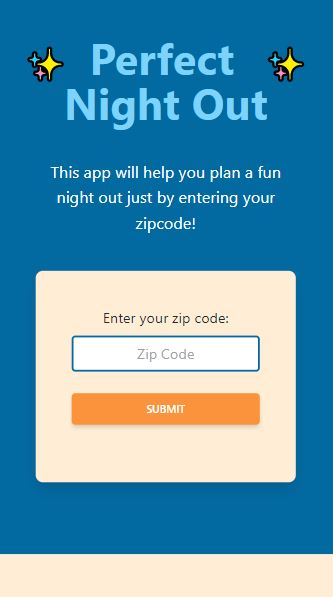
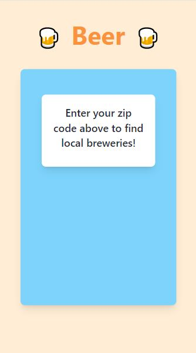
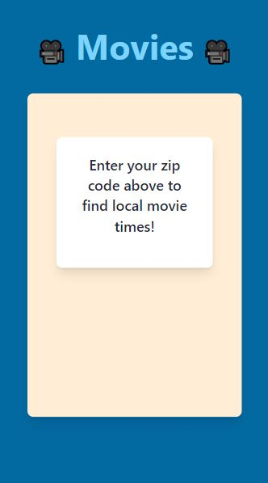

# Group Project 1 - Perfect Night Out

### Just enter your zip code and find a nearby rendezvous!

Have you ever wanted to plan a night out with your friends, but found yourself spending a ton of time looking up different places you could go? Well with this app, you can enter your zip code and find results for local breweries and movie theaters near you! When looking at your results in the Brewery section, Breweries are listed by location name, with their address and websites listed as well.

For this project, we styled each section using the Tailwind CSS Framework. It is sleek and robust, with many functions that fit our needs. It was a challenge to read through the documentation and teach ourselves a completely new technology, but once we passed the learning curve, we found it to be flexible and easy to use.

As our group built this project, our greatest challenge was locating an API that was well documented, free, and didn't result in any server errors. It made us realize the diversity that we could expect to find in third party APIs throughout our software development careers. We ended up having to adjust our project several times before we found tools that suited our needs. Once we decided on our APIs and got our styling in place, the rest of the project went without issue.

## Usage and Features

This project was built using HTML, CSS, JavaScript, jQuery, Tailwind CSS, Open Brewery DB (a third-party API), and Gracenote (a third-party API).

This is how the main page appears to users. The page is responsive, adapting to multiple screen sizes.

The user enters their zip code in the search bar at the top of the screen. Once the user has input a zipcode, the brewery section will refresh with data showing local breweries near the given zip code. Both the theater and brewery section have their own scrolling functionality.

The user is able to click on the website link in the Brewery data to be redirected to that brewery's website. They can also click on the title of the Movie to find a summary website page, along with a trailer for that particular movie.

## Deployed Site

<a href="https://ashlynn4567.github.io/GroupProject1-PerfectNightOut/">Plan the perfect night out!<a>

## Suggestion Box

In the future, we would like to add the following improvements:

- Add an API that provides restaurants along with the breweries.
- Provide an option to make a reservation at a brewery or a restaurant.
- Provide links to theaters to buy movie tickets.
- Add a photo to the movie cards.
- Add the Google Maps API to show breweries or restaurants on the map.
- Add the Google Calendar API to allow users to schedule a night out.
- Add the ability to save favorite breweries or theaters.
- Add additional searches based on user feedback.

## Credits

### Contributers

| **Ashley Smith**                                    | **Kelsey Alderman**                                                 | **Jackson Mason**                                                        | **Mohamed Abdullahi**                                            |
| --------------------------------------------------- | ------------------------------------------------------------------- | ------------------------------------------------------------------------ | ---------------------------------------------------------------- |
| - [Github](https://github.com/ashlynn4567)          | - [Github](https://github.com/kelseyalderman)                       | - [Github](https://github.com/ShibuyaCho)                                | - [Github](https://github.com/mo9399)                            |
| - [LinkedIn](www.linkedin.com/in/Ashley-Lynn-Smith) | - [LinkedIn](https://www.linkedin.com/in/kelsey-alderman-79019922b) | - [LinkedIn](https://www.linkedin.com/mwlite/in/jackson-mason-28b043228) | - [LinkedIn](http://linkedin.com/in/mohamed-abdullahi-944b2922b) |

### Acknowledgements

1. Special thanks to the following programming resources:
   - <a href="https://tailwindcss.com/">Tailwind CSS Framework</a>
   - <a href="https://www.openbrewerydb.org/">Open Brewery DB</a>
   - <a href="https://developer.tmsapi.com/Getting_Started">Gracenote API</a>
2. This project was built with the help of the University of Oregon's Coding Boot Camp.
